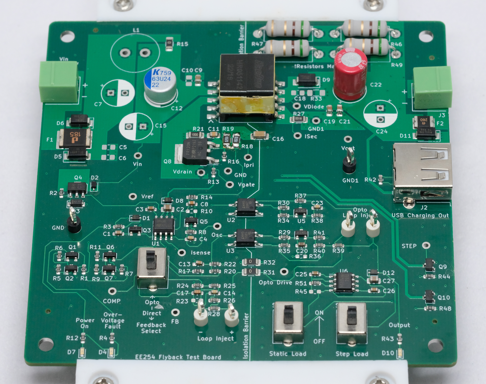

# flyback-edu-board
A basic flyback converter optimized for teaching educational labs. 
Designed for Stanford's EE 254 and optimized for the JLC assembly service. 

The board is based on the [UC3482B](https://www.onsemi.com/pdf/datasheet/uc3842b-d.pdf) current mode controller IC and provides a regulated 5V output than can be used to charge a phone. 

The board is designed to aid in teaching fundamentals of power electronics, lab techniques, and control theory. 
It is designed with test points on most relevant circuit nodes. 
The primary and secondary current can be measured with the shunt resistors on the PCB, so most work on the board can be done without the use of a current probe. 

In line with the educational goals the board is designed for low cost assembly. The kicad schematic includes LCSC part numbers for assembly at JLC. At 2023 prices a 25 unit build is <$15 with the JLC PCBA service. 

PCB designed in KICAD 6.

## Specifications
|   |   |
| -------- | -------- |
| Input Voltage | 12V - 36V |
| Output Voltage| 5V |
| Output Current | 1.5A |

## Features
- Built in DC and stepped resistive load
- USB A output
- Short and reverse polarity protection
- Output protected from over-voltage due to regulation fault
- Test points on critical circuit nodes
- Switchable between direct and opto-isolated voltage regulation loops

